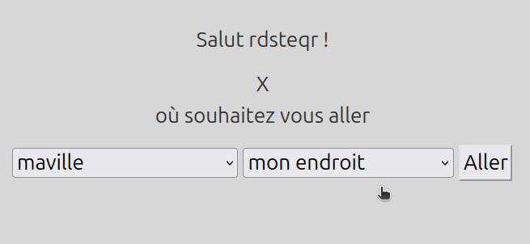

# hi
#i18N
- comment être connecté-e ? tu peux réparer le cable rj45?? c'est par ici le login
- ajouter seulement des villes avant le login svp pour etre deposee "quelque part"
 - my roadmap 2 become 1 hacker
-lancer les scripts dans la console rails
```
require "db/ville"
```
 
 
